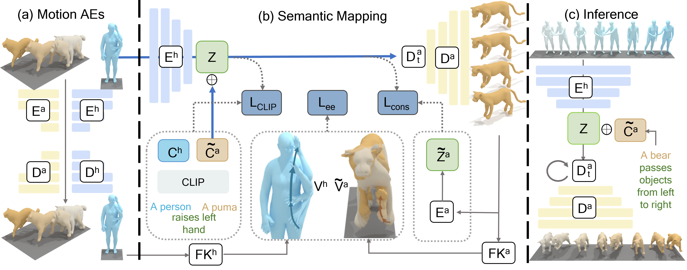

# OmniMotionGPT
Codebase for OmniMotionGPT: Animal Motion Generation with Limited Data (CVPR2024)

[Project Page](https://zshyang.github.io/omgpt-website/)




## Introduction

Our work aims to generate diverse and realistic animal motion sequences from textual descriptions, without a large-scale animal text-motion dataset. While the task of text-driven human motion synthesis is already extensively studied and benchmarked, it remains challenging to transfer this success to other skeleton structures with limited data. In this work, we design a model architecture that imitates Generative Pretraining Transformer (GPT), utilizing prior knowledge learned from human data to the animal domain. We jointly train motion autoencoders for both animal and human motions and at the same time optimize through the similarity scores among human motion encoding, animal motion encoding, and text CLIP embedding. Presenting the first solution to this problem, we are able to generate animal motions with high diversity and fidelity, quantitatively and qualitatively outperforming the results of training human motion generation baselines on animal data. Additionally, we introduce AnimalML3D, the first text-animal motion dataset with 1240 animation sequences spanning 36 different animal identities. We hope this dataset would mediate the data scarcity problem in text-driven animal motion generation, providing a new playground for the research community.

## Features

- Training and evulation scripts are provided in the ``OmGPT\motion_mapping`` folder. 
- Data pre-process tools are provided in the ``OmGPT\data_process`` foler. 
- The whole dataset is included in the ``data`` foler. 

## Installation & Use

- To set up the virtual environment for training and evaluation, please utilize the Docker files located in the ``docker`` folder.

- Training: 
	Employ the ``OmGPT\motion_mapping\exp\scripts\train.sh`` script to train our model. 
	
- Evaluation:
	Use the evaluation scripts located at ``OmGPT\motion_mapping\evl\scripts`` for different evaluations tasks. 


## AnimalML3D Dataset

We introduce AnimalML3D, the dataset pairing text descriptions with 3D animal motions, which consists of 3720 human-written textual descriptions accompanying
1240 motions of 36 different animal identities. It is generated from DeformingThings4D dataset (https://github.com/rabbityl/DeformingThings4D). We select motion sequences, register them under SMAL template (https://smal.is.tue.mpg.de/). We hope our new dataset can provide a solid new playground for researchers interested in the animal text-motion task.

## Citation
```
@misc{yang2023omnimotiongpt,
      title={OmniMotionGPT: Animal Motion Generation with Limited Data}, 
      author={Zhangsihao Yang and Mingyuan Zhou and Mengyi Shan and Bingbing Wen and Ziwei Xuan and Mitch Hill
      and Junjie Bai and Guo-Jun Qi and Yalin Wang},
      year={2023},
      eprint={2311.18303},
      archivePrefix={arXiv},
      primaryClass={cs.CV}
}
```
## Acknowledge

We thank the original contributors of the following open-source repos:

- The evaluation implementaion relies on resources from T2M-GPT (https://github.com/Mael-zys/T2M-GPT/tree/main) and Pytorch-Fid (https://github.com/mseitzer/pytorch-fid/tree/master).

- Our dataset is processed from the DeformingThings4D dataset (https://github.com/rabbityl/DeformingThings4D).

